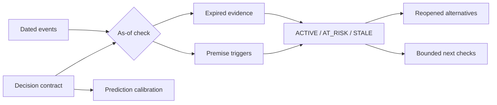

# Decision Drift

> Memory that knows when it may be wrong.


[](https://github.com/dengjihui1/decision-drift/actions/workflows/ci.yml)
[](https://www.python.org/)
[](LICENSE)

Decision Drift turns consequential choices into living contracts. A contract records the choice, rationale, assumptions, evidence, rejected alternatives, predictions, and observable conditions that should force a review.

Unlike a decision log, it can say when old reasoning may no longer apply. Unlike generic AI memory, every alert is traceable to a dated event and an explicit rule. It never decides that the original choice was wrong.

## What makes it different

| Approach | Remembers why | Detects premise change | Reopens rejected options | Checks predictions | Prevents future leakage |
| --- | :---: | :---: | :---: | :---: | :---: |
| Architecture decision record | Yes | No | No | No | No |
| Decision journal | Yes | Manual | Manual | Sometimes | Manual |
| Generic RAG memory | Retrieves text | No explicit rule | No | No | Not guaranteed |
| **Decision Drift** | **Yes** | **Yes** | **Yes** | **Yes** | **Yes** |

The last column matters: a review dated 1 August cannot use an event from September. Decision Drift performs an as-of replay and reports future-dated events it excluded.

## How it works



The runtime is local-first, deterministic, and built with the Python standard library. It needs no account, API key, or network connection.

## Run the synthetic demo

Clone the repository and run:

```bash
python scripts/decision_drift.py validate demo/decision-ledger.json demo/events.json
python scripts/decision_drift.py check demo/decision-ledger.json demo/events.json --output-dir demo/output
python scripts/decision_drift.py calibrate demo/decision-ledger.json --output-dir demo/output
```

Expected summary:

```text
VALID: Decision Drift inputs passed structural and reference checks
CHECKED: ACTIVE=0, AT_RISK=1, STALE=2, REPLACED=0
CALIBRATED: predictions=2
```

The fictional timeline shows three distinct cases:

- a SQLite decision becomes `STALE` when concurrency and data-volume premises fail;
- a compact-model decision becomes `AT_RISK` after the rejected option becomes cheaper;
- an omitted research metric becomes `STALE` when new evidence challenges its premise.

The check writes a human review, machine-readable audit trail, and Mermaid graph. See the committed [demo report](demo/output/DRIFT_REPORT.md).

## Install the CLI

```bash
python -m pip install .
decision-drift --help
```

Commands:

```text
decision-drift validate LEDGER [EVENTS]
decision-drift check LEDGER EVENTS --output-dir OUTPUT [--review-date YYYY-MM-DD]
decision-drift calibrate LEDGER --output-dir OUTPUT
```

## Use it as a Skill

Copy this repository into a Codex-compatible skills directory, or upload the release ZIP to a compatible agent marketplace. Then invoke it with a concrete request:

```text
Use $decision-drift to turn these architecture notes into a decision contract.
Label inferred assumptions and do not invent thresholds.
```

The Skill guides capture and review; the Python engine performs deterministic validation and checking. The canonical formats are documented in [the protocol](references/protocol.md) and [rule language](references/rule-language.md).

## Output contract

- `decision-ledger.json`: choices, premises, evidence, alternatives, predictions, and rules.
- `events.json`: dated observations with source references.
- `DRIFT_REPORT.md`: prioritized review for a human decision-maker.
- `drift-report.json`: complete rule-evaluation trail.
- `decision-graph.mmd`: decision-to-trigger-to-alternative graph.
- `CALIBRATION_REPORT.md`: prediction ranges compared with recorded outcomes.

## Safety and epistemic boundary

- An absent fact is `UNOBSERVED`, never silently interpreted as safe.
- A trigger means “review this premise”, not “the decision was bad”.
- `REPLACED` decisions remain historical and cannot reactivate automatically.
- The engine never reverses a choice, changes code, or contacts a third party.
- Public examples are synthetic. Private ledgers should remain local unless the owner chooses otherwise.

## Research direction

The research hypothesis and falsifiable benchmark are described in [RESEARCH_THESIS.md](docs/RESEARCH_THESIS.md) and [EVALUATION_PLAN.md](docs/EVALUATION_PLAN.md). The project is deliberately framed as a testable protocol, not a claim that decision quality has already improved.

## Development

```bash
python -m unittest discover -s tests -v
python -m compileall -q decision_drift scripts
```

Decision Drift is released under the MIT License.
